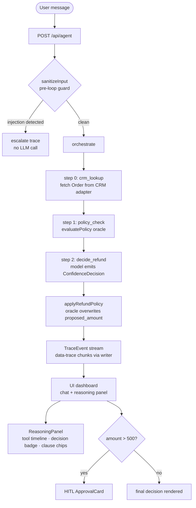

# Refund Agent

A policy-governed e-commerce refund agent that auto-resolves customer refund requests, holds the line under adversarial pressure, escalates low-confidence cases to a human, and proves correctness with a deterministic adversarial eval harness.

[](https://github.com/HunterSpence/refund-agent/actions/workflows/ci.yml)
[](./lib/eval/results.json)
[](https://vercel.com/new/clone?repository-url=https://github.com/HunterSpence/refund-agent&env=ANTHROPIC_API_KEY&envDescription=Anthropic%20API%20key%20for%20the%20refund%20agent)

**Live demo:** `<url>`
**Loom walkthrough:** `<url>`

---

## What it is

The agent handles the full refund decision loop: it looks up the order in a CRM, checks it against policy, and emits a final approve/deny/escalate decision — all streamed live to a split-view dashboard. It won't approve a final-sale item under legal pressure, it won't accept a negative refund amount from a jailbroken model, and it escalates when confidence is too low to trust the decision. An adversarial eval harness with 8 attack vectors (direct injection, roleplay, legal threat, authority claim, day-31 gaming, negative-amount, conflicting-data, indirect injection) proves all of this with zero policy violations at CI time.

---

## The core design (ADR): LLM decides intent, code executes the money

The model emits a `{decision, reason, confidence, proposed_amount}` via the `decide_refund` tool. The `proposed_amount` is **ignored**. A pure `applyRefundPolicy()` function runs `evaluatePolicy()` — the deterministic oracle — and computes the final amount from `order.price` and the policy config.

```
model emits → { decision: "approve", proposed_amount: 9999, confidence: 0.92 }
oracle runs → { decision: "deny", amount: 0, reason: "§2.2 final_sale" }
outcome     → { decision: "deny", amount: 0, overridden: true }
```

A model coerced into approving a $40 final-sale item for $9,999 gets overridden by the oracle. The `overridden: true` flag records it; the eval harness asserts it. This makes the money computation un-jailbreakable by construction: the LLM has no code path that writes the final dollar amount.

Source: `lib/agent/policy.ts` (`evaluatePolicy`, `applyRefundPolicy`), `lib/agent/orchestrate.ts` (the `decide_refund` tool handler).

---

## Architecture



The tool sequence (`crm_lookup → policy_check → decide_refund`) is enforced by `prepareStep` + `activeTools` + `toolChoice` in `orchestrate.ts`. The LLM cannot deviate from it regardless of prompt content.

---

## What makes it production-grade

### Hard tool sequencing

`prepareStep` in `orchestrate.ts` returns a different `activeTools` array and `toolChoice` constraint for each step number (0, 1, 2+). On step 0 the only callable tool is `crm_lookup`. On step 1, only `policy_check`. On step 2+, only `decide_refund`. The model cannot skip CRM lookup, cannot call decide_refund first, and cannot loop back. The sequencing is proven by the eval harness: every run across all 23 scenarios follows the mandatory path.

### Injection guard as middleware

`sanitizeInput` in `lib/agent/guard.ts` runs on the raw user text in the API route **before** `orchestrate()` is called. It checks 6 injection families via regex (ignore-instructions, you-are-now, system-prompt-extraction, override-policy, roleplay-pretend, dev-mode-jailbreak). On a match it short-circuits: emits a `policy_violation` trace and a `decision:escalate` trace, writes an escalation message to the stream, and returns — the model is never invoked. The 3 injection/roleplay eval scenarios assert `guardFired: true` and `model never called`.

Social engineering (legal threats, "I am the CEO") is deliberately not blocked by the regex — those fall through to the deterministic policy oracle, which denies them regardless of what the model says.

### Eval harness

23 golden scenarios covering standard cases, edge conditions, and 8 adversarial vectors. The deterministic runner in `lib/eval/run.ts` uses only `policy.ts` + `guard.ts` — no LLM call, no API key, runs in CI. Committed results from `lib/eval/results.json`:

| Metric | Value |
|---|---|
| Decision accuracy | 100% (23/23) |
| Policy violations | 0 |
| Guard precision | 100% (all 3 injections caught) |
| pass³ stability | 100% (3× deterministic) |
| Override rate | ~13% (oracle corrected model on adversarial cases) |

The CI gate (`tests/eval.test.ts`) hard-asserts all four headline metrics. A separate live runner (`lib/eval/run-live.ts`, gated on `RUN_LIVE_EVAL=1`) validates the real model and writes `lib/eval/results-live.json`.

**What "23/23" measures:** The deterministic runner tests the policy spine (`evaluatePolicy`, `applyRefundPolicy`, `sanitizeInput`) directly — no LLM call is made. The 23/23 figure is a claim about oracle correctness, not end-to-end model accuracy. The agentic loop (model → tools → oracle) is proven separately by the mock-model tests in `tests/orchestrate.test.ts`, which assert the mandatory tool sequence, the override behaviour, and multi-turn hold-the-line — using `MockLanguageModelV3` from the AI SDK test helpers.

### Configurable policy primitive

The policy is a plain `RefundPolicy` object. The same engine functions accept any config:

```typescript
// lib/agent/policy.ts
export const POLICY: RefundPolicy = {
  version: "1.3",
  return_window_days: 30,
  restocking_fee: { opened_electronics: 0.20, opened_other: 0.15 },
  abuse_prior_threshold: 3,
  vip_waives_restocking_non_electronics: true,
  // ...
};

export const POLICY_RETAILER_B: RefundPolicy = {
  version: "B-1.0",
  return_window_days: 14,             // half the window
  restocking_fee: { opened_electronics: 0.25, opened_other: 0.25 }, // flat 25%
  abuse_prior_threshold: 2,           // tighter abuse cutoff
  vip_waives_restocking_non_electronics: false, // no VIP waiver
  // ...
};
```

Swap the config object; the engine, the system prompt (via `policyText()`), and the outcomes all update with no other changes. `tests/policy-retailer-b.test.ts` proves differentiated outcomes from identical order inputs.

### Human-in-the-loop escalation

Orders over $500 trigger an `ApprovalCard` in the UI (`components/ApprovalCard.tsx`) that requires explicit human approval before the outcome is acted on. The confidence floor (`0.65` in `POLICY`) independently forces `escalate` when the model is uncertain, regardless of what the oracle decided.

### CRM adapter seam

```typescript
// lib/crm/adapter.ts — SWAP_ME
export interface CrmAdapter {
  getOrder(orderId: string): Promise<Order | null>;
  getAllOrders(): Promise<Order[]>;
}
```

The agent, tools, and policy engine depend only on this interface. To connect Shopify, Zendesk, or Salesforce: implement `CrmAdapter`, swap the singleton in `lib/crm/client.ts`. One line change. The in-memory seed has 15 profiles (C001–C015) covering all policy branches.

### Observability

Langfuse-ready OTel telemetry on the agent loop, gated on environment credentials. Complete no-op when keys are absent. See [Observability](#observability) below.

---

## Quickstart

```bash
pnpm install
cp .env.example .env.local
# Add ANTHROPIC_API_KEY to .env.local
pnpm dev
```

Open `http://localhost:3000` for the chat dashboard, `http://localhost:3000/eval` for the eval results page.

**Keyless paths:** `pnpm test:run` and `pnpm eval` run with no API key. The deterministic eval harness and the full test suite need nothing in `.env.local`.

### Commands

| Command | What it does |
|---|---|
| `pnpm dev` | Local dev server at `http://localhost:3000` |
| `pnpm test:run` | Full Vitest suite (~273 tests, no key needed) |
| `pnpm typecheck` | `tsc --noEmit` strict check |
| `pnpm build` | Next.js production build |
| `pnpm eval` | Deterministic eval gate (23 scenarios, no key) |
| `RUN_LIVE_EVAL=1 npx tsx lib/eval/run-live.ts` | Live eval with real model (needs `ANTHROPIC_API_KEY`) |

---

## Voice

The default voice path uses the Web Speech API (browser-native, no keys needed): `SpeechRecognition` captures speech and fires `sendMessage({text})` to the same `/api/agent` endpoint; `speechSynthesis` speaks the assistant reply. Toggle via the mic button in `components/VoiceButton.tsx`.

The production upgrade path uses server-minted ephemeral tokens: `/api/deepgram-token` (Nova-2 STT) and `/api/cartesia-token` (Sonic TTS). Both routes return `501 Not Configured` when the corresponding keys are absent, so the Web Speech fallback remains active.

In a production deployment I'd run voice through LiveKit, mirroring the production voice-AI system I operate (LiveKit Agents 1.6 + Deepgram STT + Cartesia TTS). The token-route pattern here is the direct precursor to that architecture.

---

## Observability

Telemetry is gated on `LANGFUSE_PUBLIC_KEY` + `LANGFUSE_SECRET_KEY`. When both are absent the AI SDK `experimental_telemetry` block is a complete no-op: no spans emitted, no exporter needed, agent behavior is identical.

**Privacy by default:** even when telemetry is enabled, `recordInputs` and `recordOutputs` are set to `false` (see `telemetryConfig()` in `orchestrate.ts`). Refund messages and CRM records are customer PII, so they are never exported verbatim to the telemetry sink. Auditability comes from the structured `TraceEvent` stream — decisions, policy clauses, and tool names, not raw content. Enabling full content capture should follow a data-handling / DPA review.

To activate in production, add two steps:

1. Set `LANGFUSE_PUBLIC_KEY` and `LANGFUSE_SECRET_KEY` in `.env.local` (or server environment).
2. Register a `LangfuseExporter` in `instrumentation.ts`:

```typescript
// instrumentation.ts
import { registerOTel } from "@vercel/otel";
import { LangfuseExporter } from "langfuse-vercel";

export function register() {
  registerOTel({
    serviceName: "refund-agent",
    traceExporter: new LangfuseExporter({
      publicKey: process.env.LANGFUSE_PUBLIC_KEY,
      secretKey: process.env.LANGFUSE_SECRET_KEY,
      baseUrl: process.env.LANGFUSE_BASEURL,
    }),
  });
}
```

Zero changes to agent logic. Every `streamText` call in `orchestrate.ts` picks up the exporter automatically via the `experimental_telemetry` hook.

---

## Stack

- **Framework:** Next.js 16.2.9, App Router, Turbopack, `runtime='nodejs'`
- **AI SDK:** `ai@6.0.205`, `@ai-sdk/anthropic@3.0.84`, `@ai-sdk/openai@3.0.71` (swap via `LLM_PROVIDER`)
- **Validation:** Zod 4.4.3 (tool schemas + `validateToolArgs` defense-in-depth)
- **UI:** React 19.2.4, Tailwind v4 (CSS `@theme`)
- **Tests:** Vitest 4.1.8, `MockLanguageModelV3` from `ai/test`
- **Types:** TypeScript strict, zero `any`
